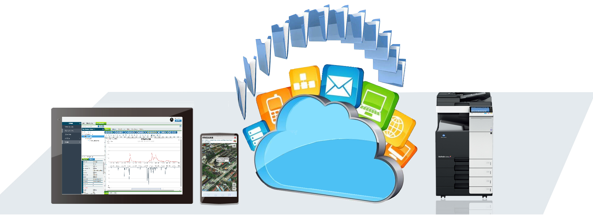

# Flying
只要在 Windows 作業系統，安裝 Flying 就可以輕易地將印表機分享出來，並供手機或電腦列印文件，而且完全不需要安裝任何的 APP，也不需要額外增購支援的印表機。只要手機或電腦和連接印表機的電腦，都處於相同網段之下，即可輕鬆地將文件列印出來。

> **加入 Facebook 社團**
>
> [https://www.facebook.com/groups/isoface/](https://www.facebook.com/groups/isoface/)
> 
> **點讚追蹤 Facebook 粉絲專頁**
> 
> [https://www.facebook.com/AIOT.ERP](https://www.facebook.com/AIOT.ERP)

Flying 配合愛招飛系列軟體，可省下上萬元購買條碼印表機，可設定列印條碼的高度，提高掃瞄範圍，可自行設定條碼下方是否加入識別文字，以便手動輸入。配合愛招飛系列軟體的獨家條碼繪製技術，直接使用，以最快速列印，最省印表耗材的方式列印。

Flying也支援 PDF 轉檔，如果分享的不是印表機，那麼手機或電腦所列印出來的檔案或者是圖片，均會自動轉換成 PDF 的格式。

Flying 只要是能用的印表機，都支援。包括針式印表機、鐳射印表機、票據印表機、證件印表機等等，都不在話下，而且當有多個印表機時可以指定印表機。

## Flying 的功能

簡單三步驟，Flying 輕鬆列印：

安裝 Flying 於 Windows 操作系統上，確認印表機已分享，且可正常列印，直接使用手機或電腦內建的列印功能。
其它Flying功能列舉如下：

1. 支援廣域網路 HTTP列印與物聯網，可依主題分類即時印出 MQTT Broker所發送之訊息。
2. Flying支援Token功能，增強使用安全性，Http請求內容均採用加密傳輸，資訊保安有保障。
3. 動態編修報表功能，拖拽即可完成設計，使用者自訂管理報表格式，配合Flying印出。其強大的報表功能，無論任何形態之報表，包括交叉報表、巢狀、還是二維碼,圖片等等，都支援。
4. 支援多種程式語言例如 Java、PPH、Js、Delphi、Python、C# …等等，只要符合Http通訊格式的電腦程式語言，都可使用Flying印出功能。
5. 擁有簡單好用的 E-mail 功能，支援多使用者環境,，受限制的 E-mail 帳號的安全和非安全的訊息存取，可將印出文件以 E-Mail 發送。並且支援郵件轉發功能，可將印出報表發送到指定收件人。
6. 所有印出之報表均可匯出，格式包括 PDF、JPG、HTML、XLS、RTF、CSV…等
7. Flying 可作為PDF伺服器使用。
8. 無需任何其它外掛程式。

* **Flying 產品介紹**： https://isoface.net/isoface/production/tool/flying
* **Flying 幫助手冊**： https://isoface.net/isoface/doc/flying/main/
* **Flying 快速上手**： https://isoface.net/isoface/study/quick-start/tars-2/flying